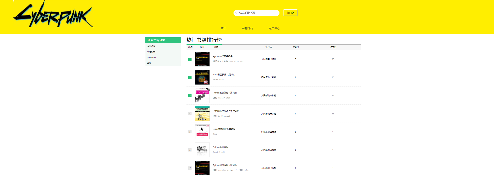

## Cyberpunk
Cyberpunk是一个编程学习资源类的网站   

是使用Django3.0 + Mysql实现了一个简单的学习资源推荐的网站

## 主要实现功能：
### 主页展示
提供基于搜索关键词和搜索记录的书籍推荐机制  

### 用户登录系统
用户可以登录网站，网站将会记录用户搜索过的关键词，推荐给用户最可能的最切合的学习资源。并提供非匿名评论服务。

### 搜索功能
用户可以根据需求搜索自己想看的书籍

### 书籍排行榜
网站提供最近24小时内点击量最大 点赞最多的资源排序进行显示。书籍还可以按照不同分类进行排序显示，比如程序语言或者网络编程等等。

### 书籍简介和点评
提供书籍基本信息，并提供点评功能、点赞功能，并会有相关书籍推荐在下方显示

### 使用
First:

    pip install  requirements.txt
    
    最后将上面目录的data文件夹中的数据导入数据库
Then:

     cd music
     python manage.py runserver

Finaly

    open the brower, using address: `127.0.0.1:8000`

### 说明
需要改进的地方还很多 欢迎交流。